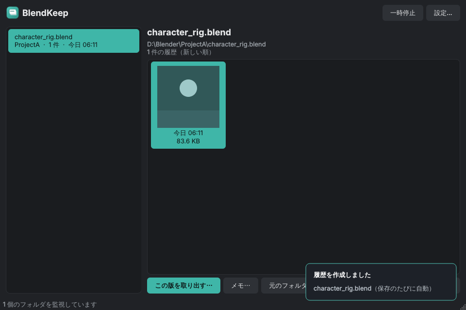

# BlendKeep

**Automatic version history for your Blender files — a Windows tray app. No add-on required.**

Blender only keeps one backup (`.blend1`). BlendKeep watches your project folders and, every time a `.blend`
is saved, stores a version you can browse (with thumbnails) and restore later.

*Rendered from demo data on Linux (the notification is a mock-up, thumbnails are sample drawings).*

## Features

- **Watches many folders / drives** — no per-project setup, nothing installed into Blender
- **Version browser** with the thumbnail embedded in each `.blend`, notes, and safe restore (never overwrites an existing file, verifies the hash)
- **Small history**: uncompressed files are zstd-compressed (a 23 MB scene → 8.4 MB), and files over 1 MB are stored as
  **deltas** — only the changed parts. Measured with Blender 5.2.2: 8 saves of a 16 MB scene = 129.6 MB → 7.1 MB (5.5%)
- **Render-finished notification** (tray, optional Discord webhook) via a tiny startup script that BlendKeep installs
  for you (`scripts/startup`; no add-on to enable)
- Notes protect a version from automatic pruning (handy for delivery builds)
- Single instance, start with Windows, move the history to another drive

## Install (Windows)

Download `BlendKeep-vX.Y.Z-windows.zip` from [Releases](../../releases), unzip, run `BlendKeep.exe`.
Verify the download with the `.sha256` file (`Get-FileHash`). The exe is not code-signed yet, so Windows
SmartScreen may warn on first launch.

Or from source: `pip install ".[gui]"` then `blendkeep-gui`. A command-line interface (`blendkeep --help`) is included.

## Status

v0.1.0 (first release). Tested on a real Windows machine, with real Blender 5.2.2 on Linux, and on GitHub Actions (Windows). Please report issues. See the Japanese [README](README.md) for details (roadmap, design, how it works).

MIT licensed.
